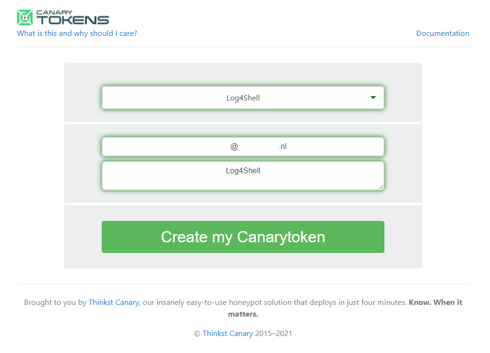
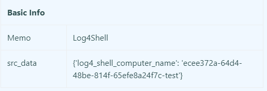

# Log4j CVE-2021-44228 checker

Checks a list of URLs with `POST` and `GET` requests in combination with parameters.

Heavily inspired by [NortwaveSecurity version](https://github.com/NorthwaveSecurity/log4jcheck).

# Set-up
## URLs to check
The list of URLs to check should be in the following format (`csv`):
```csv
description,URL,method,parameters
production,example.com/login,POST,"username,password"
staging,example.com/search,GET,"q"
```

This will subsequently run a `POST` request on `example.com/login` where the following raw body is posted: 
```username={jndi:ldap...}&password={jndi:ldap...}```

Similarly, it will run the following `GET` request: `example.com/search?q={jndi:ldap...}`.

Additionally the payload is also inserted in the header to increase the chances for a hit.

## Canary Token
To set-up without any prior configurations you can use [https://canarytokens.org/generate](https://canarytokens.org/generate) and create a Log4Shell CanaryToken:



Make sure to replace `CANARY_TOKEN` with the part in the generated url between `L4J` and `canarytokens.com`, e.g.: `ujz5sgvgo7xuvn03ft9qrws5w`.

Alternatively, you can [set-up your own DNS server](https://github.com/NorthwaveSecurity/log4jcheck).

# Running the script
Install dependencies by using `pip install-r requirements.txt`. Edit the script to change the following line to your preferred canary token:

```
CANARY_TOKEN = "mycanarytoken"
```

Now the script can be run, pointing the script to the prior created CSV with URLs to check.
```
python3 log4jcheck.py urls.csv
```

Check if the token has been triggered after the script has been completed. You will be able to cross correlate which application triggered based on the generated `UUID4` in combination with the injected parameter, e.g.: `40852c3b-2d6b-4bd5-a91f-4416aa730619-username`.


## Testing
Tested against [log4shell-vulnerable-app](https://github.com/christophetd/log4shell-vulnerable-app). Modify the `MainControll.java` as follows:

```
package fr.christophetd.log4shell.vulnerableapp;


import org.springframework.web.bind.annotation.GetMapping;
import org.springframework.web.bind.annotation.PostMapping;
import org.springframework.web.bind.annotation.RequestHeader;
import org.springframework.web.bind.annotation.RequestBody;
import org.springframework.web.bind.annotation.RequestParam;
import org.springframework.web.bind.annotation.RestController;

import org.apache.logging.log4j.LogManager;
import org.apache.logging.log4j.Logger;

@RestController
public class MainController {

    private static final Logger logger = LogManager.getLogger("HelloWorld");

    @GetMapping("/")
    public String index(@RequestHeader("X-Api-Version") String apiVersion) {
        logger.info("Received a request for API version " + apiVersion);
        return "Hello, world!";
    }

    @GetMapping("/test")
    public String testGet(@RequestParam String test) {
        logger.info("Received a request for test " + test);
        return "Test world!";
    }

    @PostMapping("/test")
    public String test(@RequestBody String test) {
        logger.info("Received a request for test " + test);
        return "Test world!";
    }

}
```

Compile and run:

```
gradle bootJar --no-daemon
java -jar .\build\libs\log4shell-vulnerable-app-0.0.1-SNAPSHOT.jar
```

Run the `log4jcheck` with the following `urls.csv` file:
```
description,URL,method,parameters
test,http://localhost:8080/test,POST,"test"
test,http://localhost:8080/test,GET,"test"
```

The following information should appear in the canary token log:



## DISCLAIMER
Note that the script only performs checks the: *User Agent* and any parameters you specify to either the `POST` or `GET` request. This will cause false negatives in cases where other headers, missed input fields, etcetera need to be targeted to trigger the vulnerability. Feel free to add extra checks to the script.

## License

Log4jcheck is open-sourced software licensed under the MIT license.
